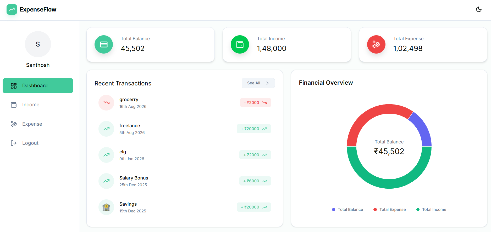
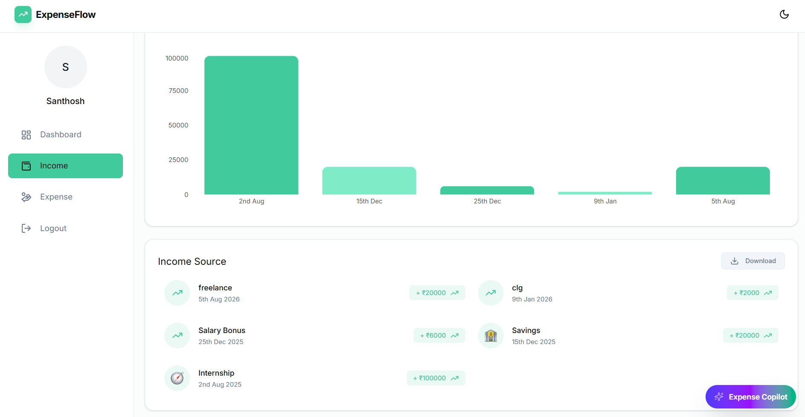
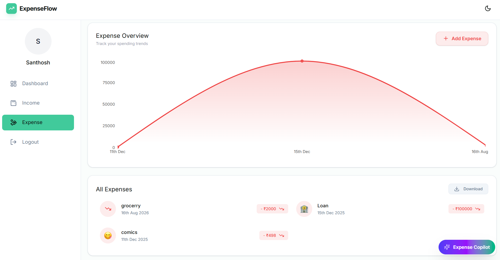

# 💰 Expense Tracker (AI/ML Edition)

A production-grade **MERN + AI/ML** expense tracker with **real-time anomaly detection**, **auto-categorization**, and a **Gemini-powered financial copilot** that understands natural language queries and renders interactive charts.

---

## 🚀 Live Demo
| Service | URL |
|---|---|
| **Frontend (React + Vite)** | [https://expense-tracker-frontend-6bgy.onrender.com](https://expense-tracker-frontend-6bgy.onrender.com) |
| **Backend API (Node/Express)** | [https://expense-tracker-backend.onrender.com](https://expense-tracker-backend.onrender.com) |
| **ML Microservice (FastAPI)** | Optional — runs on demand |

> **Free-tier note:** Render free web services spin down after 15 min inactivity. First load may take 30–60s.

---

## 📸 Screenshots
| Dashboard | Income | Expense | AI Copilot |
|---|---|---|---|
|  |  |  |  |

---

## 🛠️ Tech Stack

### Frontend
- **React 19** + **Vite** (ESM, no TypeScript — plain JSX for zero-config build)
- **Tailwind CSS v4** (CSS-first config via `@tailwindcss/vite`)
- **Recharts 3** — interactive bar/line/pie/metric-card/table charts
- **Axios** with JWT interceptors
- **React Router v7**, **react-hot-toast**, **react-icons**, **emoji-picker-react**

### Backend (Node/Express — CommonJS)
- **Express 5** + **Mongoose 8** (MongoDB Atlas)
- **JWT** auth + **bcryptjs** password hashing
- **ioredis** + **in-memory token-bucket fallback** for distributed rate limiting (RULE 2)
- **@google/generative-ai** (Gemini 3.6 Flash) with **rule-based fallback** — no hard dependency on API key
- **Zod-free** validation (custom, zero-dep) — keeps install surface minimal
- **Multer** (profile images), **xlsx** (Excel export)

### AI/ML Layer
| Component | Tech | Purpose |
|---|---|---|
| **Copilot (Node)** | Gemini 3.6 Flash + deterministic fallback | Text → MongoDB aggregation pipeline, chart spec JSON |
| **Categorizer (Python)** | FastAPI + scikit-learn TF-IDF (optional) | Zero-shot keyword scoring → 8 standard categories |
| **Anomaly Detector (Python/Node)** | Statistical z-score + 3×median rule + IsolationForest (optional) | Flags outliers in real-time on expense creation |
| **Text-to-Query** | Heuristic parser + LLM-structured output | Converts "food vs entertainment last 3 months" → safe Mongo pipeline |

### Database
- **MongoDB Atlas M0** (free) — collections: `users`, `incomes`, `expenses`, `useraiquotas`

---

## ✨ Core Features

### 🔐 Authentication
- Register / Login / Get User / Profile Image Upload
- JWT in `Authorization: Bearer <token>` header
- Passwords hashed with bcrypt (cost 10)
- Token stored in `localStorage`; 401 → auto-redirect to `/login`

### 💸 Income & Expense Management
- Add / List / Delete / Download Excel (per user, scoped by `userId`)
- **Auto-categorization**: if category missing, backend predicts from description + amount (confidence ≥ 0.65 else "Uncategorized / Review Required")
- **Real-time anomaly detection**: on every expense add, computes z-score vs last 90 days of same-category spend; flags if `z > 2.5` or `amount > 3× median` → persists `isAnomaly`, `anomalyReason`, `anomalyCheckedAt` on the document

### 📊 Dashboard Analytics
- Total income / expense / net balance
- Last 30/60-day trends
- Category breakdowns (bar/pie)
- **Anomaly feed**: recent flagged transactions surfaced in `GET /api/v1/dashboard` → renders as `AnomalyAlertBanner`

### 🤖 Expense Copilot (RULE 3, 5)
- **Floating chat panel** on all dashboard pages
- **Theme-aware**: adapts to light/dark mode automatically
- **Natural language → chart**: "Show me a bar chart of food vs entertainment over the last 3 months"
- **Structured JSON response** (`AIAnalyticsResponse`): `explanation`, `generatedQuery`, `chartType`, `chartTitle`, `xAxisKey`, `yAxisKey`, `data[]`, `summaryMetrics`
- **Multi-turn memory**: preserves last 5 conversation turns for context-aware follow-up questions
- **Chat persistence**: history saved to `localStorage` per user
- **Fallback**: if `GEMINI_API_KEY` missing, a deterministic rule engine parses keywords (bar/line/pie, category aliases, time windows) and builds the same pipeline — **works offline**.
- **Security**: every generated pipeline is sanitized (`QuerySanitizer`), forbidden stages rejected (`$out`, `$merge`, `$unionWith`), and `userId` match forced at execution layer.

### ⚡ Rate Limiting (RULE 2)
- **REST**: 100 req/min per user/IP (token bucket via Redis Lua + in-memory fallback)
- **Graceful Redis degradation**: if Redis is unreachable, the rate limiter automatically falls back to an in-memory token bucket (per-process only). Connection state is tracked via `ready`/`end`/`reconnecting` events — no retry storms.
- **AI endpoints**: 10 req/min + 100 req/day per user (`UserAIQuota` collection with TTL)
- **429 payload**:
  ```json
  { "status":429, "error":"Too Many Requests", "message":"...", "retryAfterSeconds":42, "limit":10, "remaining":0 }
  ```

---

## 📂 Folder Structure
```
Expense-Tracker/
├── backend/
│   ├── config/db.js                 # Mongo connection
│   ├── controller/                  # Express controllers
│   │   ├── aiController.js          # /ai endpoints (categorize, anomaly, query, health)
│   │   ├── authController.js
│   │   ├── dashboardController.js   # + anomalies in response
│   │   ├── expenseController.js     # + auto-categorize + anomaly check on add
│   │   └── incomeController.js
│   ├── middleware/
│   │   ├── authMiddleware.js        # JWT protect
│   │   ├── loggerMiddleware.js      # request logger + error handler
│   │   └── rateLimiter.js           # tiered token-bucket (Redis + fallback)
│   ├── models/
│   │   ├── Expense.js               # + isAnomaly, anomalyReason, anomalyCheckedAt
│   │   ├── Income.js
│   │   ├── User.js
│   │   └── UserAIQuota.js           # daily AI quota + TTL index
│   ├── routes/
│   │   ├── aiRoutes.js              # /api/v1/ai/* (protect + aiRateLimiter)
│   │   ├── authRoutes.js
│   │   ├── dashboardRoutes.js
│   │   ├── expenseRoutes.js
│   │   └── incomeRoutes.js
│   ├── src/
│   │   ├── config/redis.js          # ioredis + in-memory Map fallback + Lua script
│   │   ├── services/
│   │   │   ├── geminiService.js     # Gemini 3.6 Flash + rule fallback
│   │   │   ├── querySanitizer.js    # read-only enforcement + userId injection
│   │   │   └── redisService.js      # thin cache wrapper
│   ├── ml/                          # Python FastAPI microservice (optional)
│   │   ├── categorizer.py           # keyword + TF-IDF categorizer
│   │   ├── anomaly_detector.py      # z-score + IsolationForest
│   │   ├── text_to_sql.py           # heuristic → Mongo pipeline
│   │   ├── main.py                  # FastAPI app
│   │   └── requirements.txt
│   ├── .env.example                 # template (commit this)
│   ├── server.js                    # Express entry
│   └── package.json
├── frontend/expense-tracker/
│   ├── src/
│   │   ├── components/
│   │   │   ├── AI/
│   │   │   │   ├── AnalyticsChatbot.jsx      # SSE chat + history + suggestions
│   │   │   │   ├── DynamicChartRenderer.jsx  # JSON-driven Recharts
│   │   │   │   └── AgentStateBadge.jsx       # spinner + stage label
│   │   │   ├── Dashboard/...
│   │   │   └── layouts/...
│   │   ├── hooks/
│   │   │   ├── useUIStoreHook.js    # Zustand-like store (useSyncExternalStore)
│   │   │   └── useUserAuth.jsx
│   │   ├── store/useUIStore.js      # chatOpen, minimized, anomalyDismissed, errors
│   │   ├── types/analytics.ts       # TS types for AI response + canonical categories
│   │   ├── utils/
│   │   │   ├── apiPaths.js          # + AI endpoints
│   │   │   ├── axiosInstance.js     # JWT interceptor
│   │   │   └── offlineCache.js      # localStorage TTL cache for instant hydration
│   │   ├── App.jsx                  # Router + providers
│   │   └── main.jsx
│   ├── .env.example                 # VITE_API_BASE_URL
│   ├── vite.config.js
│   └── package.json
├── DEPLOY_TO_RENDER.md              # step-by-step free Render workbook
├── README.md
├── PROJECT_RESUME_CONTEXT.md
├── TESTING_AND_WORKFLOW_RULES.md
└── .gitignore
```

---

## ⚙️ Installation & Setup

### 1. Clone
```bash
git clone https://github.com/santhoshici/Expense-Tracker.git
cd Expense-Tracker
```

### 2. Backend
```bash
cd backend
cp .env.example .env   # edit with your values
npm install
npm run dev            # nodemon on port 8000
```

### 3. Frontend
```bash
cd frontend/expense-tracker
cp .env.example .env   # VITE_API_BASE_URL=http://localhost:8000
npm install
npm run dev            # Vite on port 5173
```

### 4. (Optional) Python ML Microservice
```bash
cd backend/ml
python -m venv .venv
source .venv/bin/activate   # Windows: .venv\Scripts\activate
pip install -r requirements.txt
uvicorn main:app --reload --port 8000
# Set ML_SERVICE_URL=http://127.0.0.1:8000 in backend/.env
```

---

## 🔐 Environment Variables

### Backend (`backend/.env`)
| Variable | Required | Default | Description |
|---|---|---|---|
| `PORT` | No | `8000` | Server port (Render injects `$PORT`) |
| `MONGO_URI` | **Yes** | — | MongoDB Atlas connection string |
| `JWT_SECRET` | **Yes** | — | `openssl rand -hex 32` |
| `CLIENT_URL` | No | `*` | Frontend origin for CORS |
| `GEMINI_API_KEY` | No | — | Google AI Studio key; empty → rule fallback |
| `AI_DAILY_QUOTA` | No | `10` | Per-user daily AI query limit |
| `REDIS_URL` | No | — | Upstash Redis; empty → in-memory fallback |
| `ML_SERVICE_URL` | No | — | FastAPI ML service URL; empty → skip |
| `NODE_ENV` | No | `development` | `production` on Render |

### Frontend (`frontend/expense-tracker/.env`)
| Variable | Required | Default | Description |
|---|---|---|---|
| `VITE_API_BASE_URL` | **Yes** | `http://localhost:8000` | Backend API base URL (baked at build time) |

> See `backend/.env.example` and `frontend/expense-tracker/.env.example` for templates.

---

## 🚀 Deploy to Render (Free Tier)
**Complete step-by-step workbook:** → [`DEPLOY_TO_RENDER.md`](DEPLOY_TO_RENDER.md)

Deploys 3 services for **$0/month**:
- Backend Web Service (Node)
- Frontend Static Site (Vite build)
- Optional ML Web Service (Python/FastAPI)

---

## 🔧 API Reference (Key Endpoints)

### Auth
| Method | Path | Auth | Description |
|---|---|---|---|
| POST | `/api/v1/auth/register` | ❌ | Register user |
| POST | `/api/v1/auth/login` | ❌ | Login → returns JWT |
| GET | `/api/v1/auth/getUser` | ✅ | Get current user |

### Income / Expense
| Method | Path | Auth | Description |
|---|---|---|---|
| POST | `/api/v1/income/add` | ✅ | Add income (source, amount, date, icon) |
| GET | `/api/v1/income/get` | ✅ | List all income |
| DELETE | `/api/v1/income/:id` | ✅ | Delete income |
| POST | `/api/v1/expense/add` | ✅ | Add expense (category optional → auto-categorize) |
| GET | `/api/v1/expense/get` | ✅ | List all expenses (includes `isAnomaly`, `anomalyReason`) |
| DELETE | `/api/v1/expense/:id` | ✅ | Delete expense |
| GET | `/api/v1/dashboard` | ✅ | Dashboard totals + recent txns + `anomalies[]` |

### AI / ML
| Method | Path | Auth | Rate Limit | Description |
|---|---|---|---|---|
| GET | `/api/v1/ai/health` | ❌ | — | `{status, engine, geminiModel, ruleFallback, mlService}` |
| POST | `/api/v1/ai/categorize` | ✅ | 10/min | `{description, amount?}` → `{category, confidence, suggested}` |
| POST | `/api/v1/ai/anomaly` | ✅ | 10/min | `{amount, history[], category?}` → `{isAnomaly, anomalyReason, zScore, pctAboveMean}` |
| POST | `/api/v1/ai/query` | ✅ | 10/min + 100/day | `{question, chatHistory?}` → `{ success, data: AIAnalyticsResponse, engine, engineLabel }` |

### Response Format (`/api/v1/ai/query`)
```json
{
  "success": true,
  "data": {
    "explanation": "Here's your spending by category...",
    "generatedQuery": "[MongoDB aggregation pipeline]",
    "chartType": "bar",
    "chartTitle": "Expenses by Category",
    "xAxisKey": "category",
    "yAxisKey": "total",
    "data": [{ "category": "Food", "total": 1500 }, ...],
    "summaryMetrics": { "totalSpend": 4200, "topCategory": "Food" }
  },
  "engine": "gemini-3.6-flash",
  "engineLabel": "Gemini 3.6 Flash"
}
```

> If `GEMINI_API_KEY` is missing or Gemini fails, the response falls back to a deterministic rule-based engine (`engine: "rule-based-fallback"`).

---

## 🧪 Testing & Quality

```bash
# Backend syntax check
cd backend
node --check src/config/redis.js
node --check src/middleware/rateLimiter.js
node --check src/services/geminiService.js
node --check src/services/querySanitizer.js
node --check controller/aiController.js
node --check controller/expenseController.js
node --check controller/dashboardController.js
node --check server.js

# Frontend build
cd frontend/expense-tracker
npm run build   # exits 0 if clean
```

---

## 📝 License
ISC — see `backend/package.json`.

---

## 🙌 Author
**Santhosh Kumar**  
🔗 [GitHub](https://github.com/santhoshici) • [LinkedIn](https://www.linkedin.com/in/santhoshkumar546)

---

> **Note on `.env`:** The `.gitignore` excludes `.env`; it is **not** tracked in git. Templates are in `backend/.env.example` and `frontend/expense-tracker/.env.example`. If you previously committed a `.env` with secrets, **rotate them** (new Atlas DB user + `openssl rand -hex 32`) and purge the old values from git history.
>
> **Local DNS proxy fix:** If your system DNS resolves to `127.0.0.1` (VPN/ad-blocker proxy), Node.js's c-ares resolver cannot look up MongoDB Atlas SRV records. The backend detects this and overrides c-ares with public resolvers (`8.8.8.8`, `1.1.1.1`) for `mongodb+srv://` connections. This is handled automatically in `config/db.js`.
